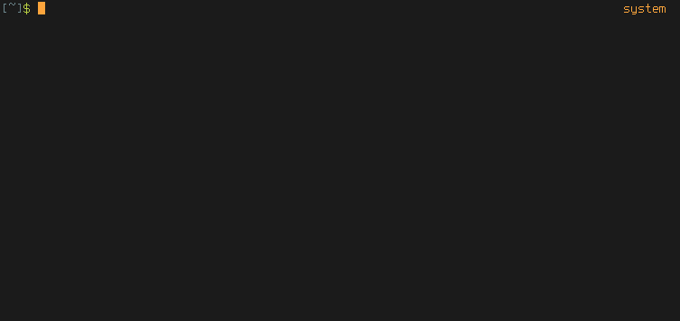

A tool to browse and search a constantly updated local copy of the entire Arch Wiki on the command line using `man`.

# Screenshot


With colors (this depends on your own configuration) and showing off language support:



# Installation

```
npm install -g arch-wiki-man
```

Or you can also install it [through the AUR](https://aur.archlinux.org/packages/arch-wiki-man/). For example, using yaourt:

```
yaourt -S arch-wiki-man
```

# Updating through npm

## npm

Just reinstall the package:

```
npm install -g arch-wiki-man

```

Updates are pushed automatically every two days to `https://github.com/greg-js/arch-wiki-md-repo`, a dependency for this project. Whenever the install command is run, arch-wiki-man will fetch the changes from arch-wiki-md-repo, giving you access to the latest changes.

## yaourt

Just reinstall the package (see paragraph above for explanation):

```
yaourt -S arch-wiki-man
```

Of course you don't *have* to use yaourt for reinstalling the package, this is just an example. Use any helper you want or compile the AUR package yourself.

# Usage & Examples

## Basic

```
awman beginners guide
```

Just one match for `beginners guide` so the article will open with `man`. By the way, `awman` stands for arch wiki man.

## Multiple matches

```
awman guide
```

There are multiple matches for `guide` so a selection menu will be displayed. Use the arrow keys or vim-style keybindings (j/k) to select the one to read.

## Search in descriptions

```
awman -d i3
```

The `-d` or `--desc-search` option causes searches to scan both the titles _and_ the descriptions for a match.

## Apropos

```
awman -k wayland
```

The familiar `-k` or `--apropos` option causes searches to scan the contents for a match as well. It's worth noting that this option makes searches run significantly slower.

## Open in a browser

```
awman -w tmux
```

The `-w` or `--web` option opens the resulting match in a web browser rather than with `man`. It uses `xdg-open` to open the relevant url in your default browser.


(sorry for the bad resolution in this screenshot)

## Search in other languages

```
awman -l spanish openbox
```

The default is English and you can get a list of available language options with `awman --list-languages`. For now though, only the articles that are hosted on the same domain as the English Arch Wiki have been added to the database.

If your search fails to find any results, `awman` will automatically fall back to an English-language search.

## Cancel searches

Simply do a `ctrl-c` to exit the selection menu without entering `man`. To exit `man`, press `q`.

# License

Licensed under GPLv3
