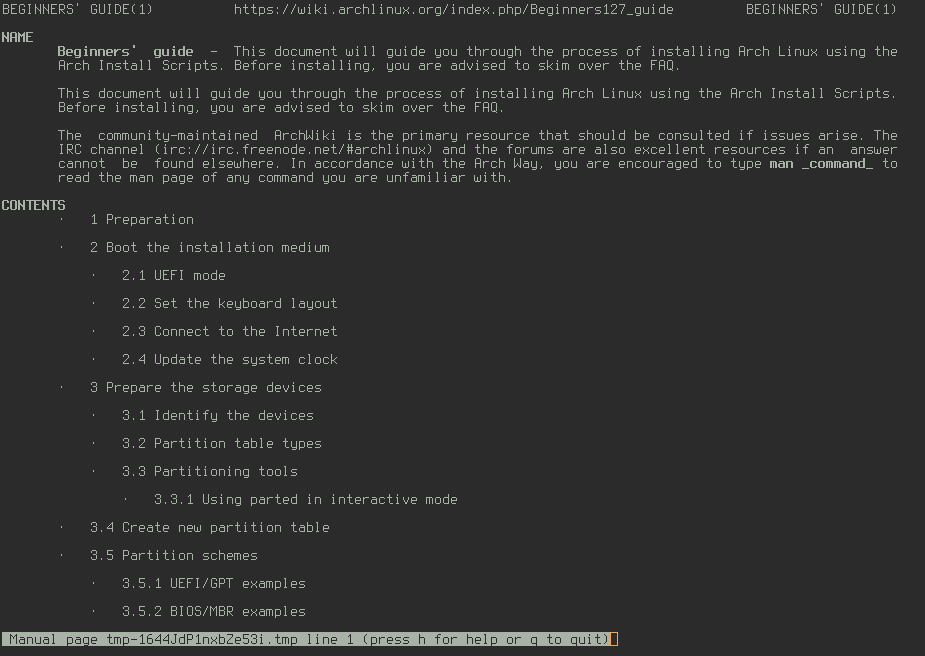

A tool to browse and search a constantly updated local copy of the entire (English) Arch Wiki on the command line using `man`.

# Installation
```
npm install -g arch-wiki-man
```



# Usage & Examples

Use the `awman` command (it stands for arch wiki man)

```
awman beginners guide
```
--> Just one match for `beginners guide` so the article will open with `man`

```
awman guide
```
--> Multiple matches for `guide` so a selection menu will be displayed

```
awman -d i3
```
--> `-d` or `--desc-search` option searches in the descriptions for a match as well as in the titles

```
awman -k wayland
```
--> `-k` or `--apropos` option searches in the contents for a match.

```
awman -w tmux
```
--> `-w` or `--web` option opens the resulting match in a web browser rather than with `man`

# Updating
```
npm install -g arch-wiki-man

```
Updates are pushed automatically every two days to `https://github.com/greg-js/arch-wiki-md-repo`, a dependency for this project. Whenever the install command is run, the changes will be fetched.

# License
Licensed under GPLv3
